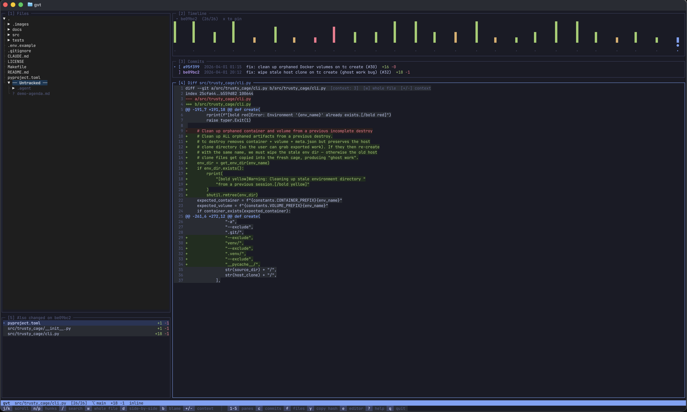
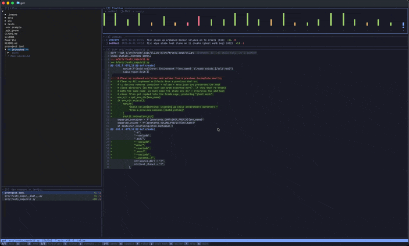
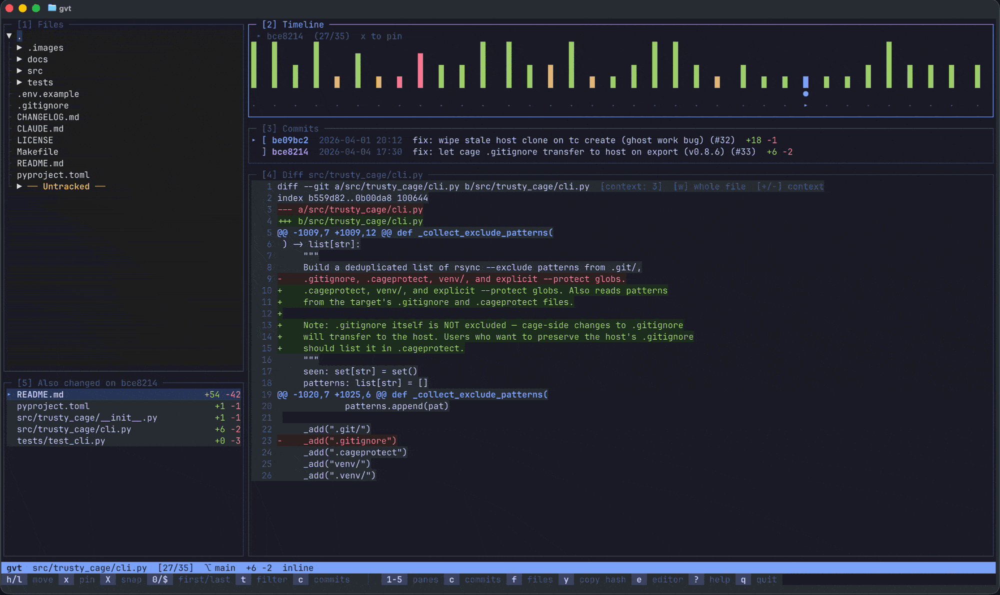
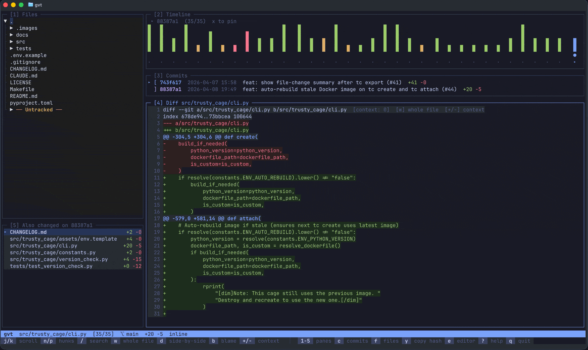
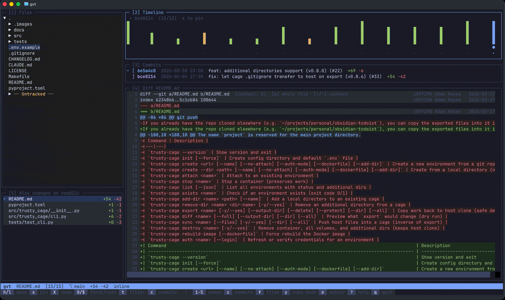

# gvt — Git Visual Timeline

A keyboard-driven TUI for exploring the commit history of any file in a git repo. Think lazygit meets a video timeline scrubber, focused on per-file history.



**gvt is a read-only history explorer, not a git UI.** It doesn't stage, commit, push, or manage branches — lazygit is great for that. gvt does one thing: lets you scrub through a file's commit timeline, see what changed and when, and understand how code evolved over time. It's the tool you reach for when you're staring at a file and asking "how did this get here?"

## Install

```bash
pip install git-visual-timeline
```

## Usage

```bash
# Open in any git repo
gvt

# Jump directly to a file
gvt path/to/file.py
```

## Layout

gvt uses a 5-pane layout, each accessible by number key:

| Pane | Name | What it shows |
|------|------|---------------|
| 1 | Files | File tree with lazy-loading directories |
| 2 | Timeline | Heatmap of commits (green=adds, red=deletes, amber=mixed) |
| 3 | Commits | Message, hash, date, and stats for visible commits |
| 4 | Diff | Syntax-highlighted diff with blame, search, and context controls |
| 5 | Changed Files | All files touched by the current commit |

## Features

### Timeline Navigation

Scrub through a file's commit history one tick at a time. Each tick is colored by change type — green for additions, red for deletions, amber for mixed.



### Pin Mode

Press `x` to pin a commit, then move to another and press `x` again to diff any two commits. Press `x` a third time to clear. Use `X` to snap the nearest pin to your cursor.



### Inline Blame

Toggle blame annotations with `b` to see who last modified each line, right-aligned alongside the diff.



### File Search

Press `f` for an fzf-style fuzzy file picker that filters as you type.



### All Features

- **Syntax-highlighted diffs** with inline, whole-file (`w`), and side-by-side (`d`) views
- **Diff search** (`/`) — regex search within the diff with `n`/`p` to navigate matches
- **Commit search** (`c`) — fuzzy search all repo commits by message, branch, or author
- **Time filter** (`t`) — filter timeline by date range (1w, 1m, 3m, 6m, 1y, custom date)
- **Contributor breakdown** (`B`) — who changed the file and how much
- **WIP indicator** — hollow tick showing uncommitted changes
- **Copy to clipboard** (`y`/`Y`) — short or full commit hash
- **Open in editor** (`e`) — open current file in `$VISUAL`/`$EDITOR`/vim
- **Remember last file** — reopens to the last file you were viewing per repo
- **tmux integration** — seamless pane switching at edges
- **Preloaded diffs** — adjacent commits pre-cached for instant navigation
- **Context-sensitive status bar** showing relevant shortcuts per pane

## Keybindings

### Global

| Key | Action |
|-----|--------|
| `1`-`5` | Jump to pane |
| `Ctrl+h/j/k/l` | Navigate panes directionally |
| `c` | Search commits (all repo) |
| `f` / `Ctrl+P` | Search files |
| `t` | Time filter |
| `w` | Toggle whole-file view |
| `d` | Toggle side-by-side diff |
| `b` | Toggle inline blame |
| `B` | Contributor breakdown |
| `/` | Search in diff |
| `n`/`p` | Next/prev diff hunk |
| `y` / `Y` | Copy short/full commit hash |
| `e` | Open file in editor |
| `?` | Help |
| `q` | Quit (with confirmation) |
| `qq` | Quit immediately |

### Timeline (Pane 2)

| Key | Action |
|-----|--------|
| `h`/`l` | Move cursor |
| `0`/`$` | Jump to first/last commit |
| `x` | Pin commit (1st=start, 2nd=end, 3rd=clear) |
| `X` | Snap nearest pin to cursor |

### Diff (Pane 4)

| Key | Action |
|-----|--------|
| `j`/`k` | Scroll |
| `g`/`G` | Top/bottom |
| `+`/`-` or `m`/`l` | More/less context lines |
| `Shift+Left/Right` | Horizontal scroll |

### Search Modals

| Key | Action |
|-----|--------|
| `Tab` / `Shift+Tab` | Navigate results |
| `Ctrl+n` / `Ctrl+p` | Navigate results (alternative) |
| `Enter` | Select |
| `Esc` | Close |

## Requirements

- Python 3.10+
- A git repository

## License

MIT
